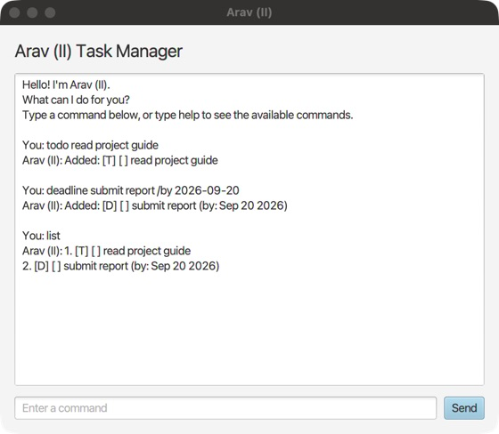

# Arav (II) User Guide

Arav (II) is a friendly task manager for todos, deadlines, and events. It
provides both a JavaFX graphical interface and a text interface. Start the
application, type a command, and press **Send** in the GUI or **Enter** in the
text interface.



## Quick start

1. Install Java 25 if it is not already installed. Open a terminal and run
   `java -version` to confirm that the version starts with `25`.
2. Download the JAR for your computer from
   [Arav (II) releases](https://github.com/arav31/ip/releases):
   `aravii-mac-aarch64.jar` for Apple Silicon Macs (M1 or newer), or
   `aravii.jar` for Intel Macs, Windows x64, and Linux x64.
   Windows ARM and Linux ARM packages are not currently supplied.
3. Put the JAR in a folder where you can save files. Open a terminal in that
   folder and launch it with the matching command below.

For Apple Silicon Macs:

```sh
java -jar aravii-mac-aarch64.jar
```

For Intel Macs or Linux x64:

```sh
java -jar aravii.jar
```

For Windows x64:

1. Install the **Windows x64 JDK 25** distribution. If the installer offers
   an option to add Java to `PATH`, enable it, then reopen PowerShell.
2. Download `aravii.jar` and place it in a writable folder, for example
   `C:\Users\YourName\Documents\AravII`. Replace `YourName` with your Windows
   username and create the folder if needed.
3. In PowerShell, change to that folder and run:

```powershell
cd "C:\Users\YourName\Documents\AravII"
java -version
java -jar .\aravii.jar
```

Confirm that `java -version` reports Java 25 before launching. Keep the
filename ending in `.jar`; do not extract it. The JAR includes the Windows
JavaFX libraries, so no separate JavaFX installation is needed.
For the text interface on Windows, use:

```powershell
java -cp .\aravii.jar aravii.AravII
```

Windows saves tasks in `data\aravii.txt` inside your chosen folder.
If PowerShell reports that `java` is not recognized, check that your JDK's
`bin` folder is on `PATH`, then reopen PowerShell. If an older Java version
appears, select your Java 25 installation before running the app.

The graphical window opens. Enter `todo read the project guide` and click
**Send**, then enter `list` to see your first task. Type `help` for the command
reference and `bye` to exit.

To use the text interface instead, run
`java -cp aravii.jar aravii.AravII` (replace the JAR filename with
`aravii-mac-aarch64.jar` on Apple Silicon).

Tasks are saved automatically to `data/aravii.txt` inside the folder from
which you run the application. Always launch from that same folder to load
the same tasks. You do not need to download the source code or install Gradle.

## Commands

Enter one command at a time. Command names and the markers `/by`, `/from`,
and `/to` are case-sensitive: use `list`, not `List`.
In the formats below, replace text inside `<...>` with your own value;
do not type the angle brackets. Descriptions can contain spaces.

### Add tasks

Add a task without a date with `todo <description>`:

```text

todo read the project guide
```

Add a task with a due date using
`deadline <description> /by <YYYY-MM-DD>`:

```text
deadline submit report /by 2026-09-20
```

Add an event using
`event <description> /from <YYYY-MM-DD HH:MM> /to <YYYY-MM-DD HH:MM>`.
Times use the 24-hour clock:

```text
event team meeting /from 2026-09-21 14:00 /to 2026-09-21 15:00
```

The application rejects empty descriptions, invalid calendar dates, invalid
times, and events whose end time is earlier than their start time.
Equal start and end times are accepted. Each successful addition produces
an `Added:` response, for example:

```text
Added: [D] [ ] submit report (by: Sep 20 2026)
```

### View and search tasks

```text
list
find report
sort
```

`list` displays every task. Use `find <keyword>` to search descriptions and date details,
ignoring letter case. `sort` orders tasks alphabetically by description,
ignoring letter case. Equal descriptions retain their original order.

Example list after adding the todo and deadline above:

```text
1. [T] [ ] read the project guide
2. [D] [ ] submit report (by: Sep 20 2026)
```

`[T]` means todo, `[D]` means deadline, and `[E]` means event.
`[ ]` means incomplete; `[X]` means completed.
Search results keep the task numbers from the full list. If nothing matches,
Arav (II) responds with `No matching tasks found.`

### Update tasks

Use `mark <number>`, `unmark <number>`, or `delete <number>`.
Task numbers start at `1` and are shown by `list` and search results:

```text
mark 1
unmark 1
delete 1
```

`mark` completes a task, `unmark` reopens it, and `delete` removes it.
Deleting or sorting can change task numbers. Run `list` again before choosing
another task to update. Deletion has no undo command.

### Get help and exit

```text
help
bye
```

`help` displays the command reference. `bye` saves pending changes and exits.

## Saving and errors

The application creates missing save folders automatically. If the save file
is missing, Arav (II) starts with an empty task list. If the file is corrupted,
Arav (II) reports the affected record and leaves the original file unchanged.
Only `help` and `bye` remain available in that session. Exit with `bye`, make
a backup copy of `data/aravii.txt`, then repair the reported record and restart.
To start with an empty list instead, move the original file to a safe backup
location before restarting. Keep the backup so you can recover its tasks later.

If a save fails, the current changes remain in memory and the application
prevents a normal exit until saving succeeds. Repair the file path or its
permissions, then enter `bye` again. In the GUI, closing the window follows
the same safe-save behavior. Keep the app open while resolving the error:
force-quitting or losing power can lose changes that have not been saved.
Avoid running two instances from the same folder at the same time.

## Common errors

- Use a task number shown by `list`; task numbers start at `1`.
- Use exactly one date format: `YYYY-MM-DD`.
- Use exactly one time format: `YYYY-MM-DD HH:MM`.
- Keep each command on one line and do not include tabs or control characters
  in descriptions.
- If your tasks appear to be missing, check that you launched from the same
  folder as before; each working folder has its own `data/aravii.txt`.
- If the terminal cannot find Java, install Java 25 and reopen the terminal.
- If it cannot access the JAR, check the filename and open the terminal in
  the folder containing the downloaded JAR.
